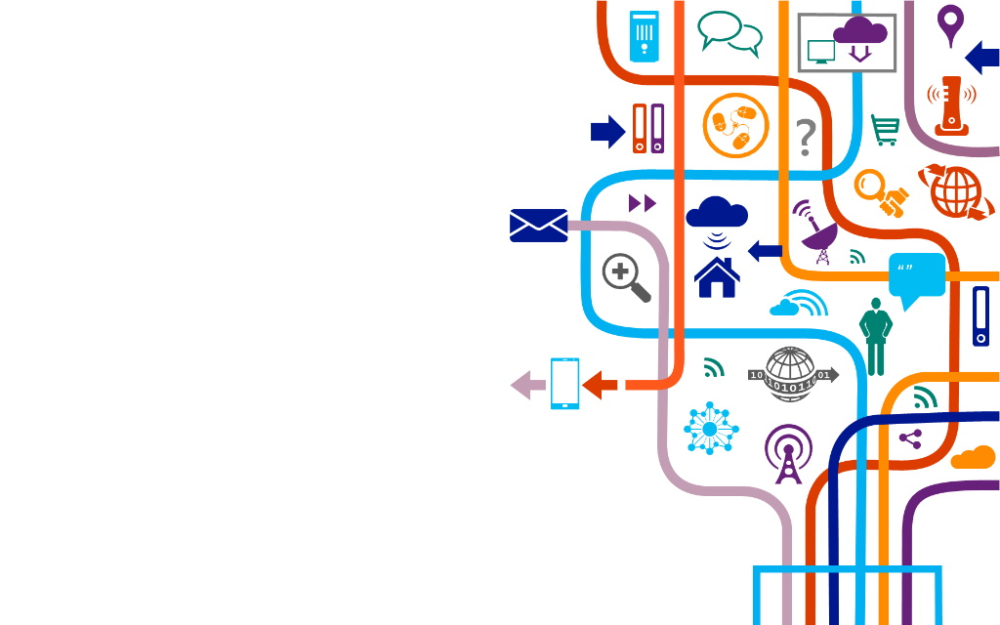

---

layout: ribbon

style: |

    #Cover h2 {
        margin:30px 0 0;
        color:#FFF;
        text-align:center;
        font-size:70px;
        }
    #Cover p {
        margin:10px 0 0;
        text-align:center;
        color:#FFF;
        font-style:italic;
        font-size:20px;
        }
        #Cover p a {
            color:#FFF;
            }
    #Picture h2 {
        color:#FFF;
        }
    #SeeMore h2 {
        font-size:100px
        }
    #SeeMore img {
        width:0.72em;
        height:0.72em;
        }
---

# IoT Workshop
 
 IoT solutions on Azure
 
 Excersises

## I: Create IoT Hub
1. Go to Azure Portal
2. Create IoT Hub
    - preferable S1 tier
    - 1 unit
    - 4 partitions
3. Create device
    - IoT Devices -> New 
    - with symetric key
4. Go to your device and open connection strings, we will need it later
    - IoT Devices -> your device -> Primary Connection String

## I: VS Code for IoT Hub
5. In VS Code call *Command Palette* and call *Azure: Sign in*
6. In Explorer at the bottom go to *Azure IoT Hub*
    - select *More actions...*
    - *Select IoT Hub*
7. Select Devices
    - select your device
    - *Start monitoring build-in endpoints*
    - observe messages in Output window

## I: VS Code Simulate device
1. Select Devices
    - select your device
    - *Send D2C Messages*
    - set your text and send
2. While sending look into Output windows

## II: IoT DevKit

1. Update firmware
    - [Firmware link](https://bit.ly/2riKrLw){:target="_blank"}; [Firmware updating instruction](https://bit.ly/34Pug60){:target="_blank"}
    - Drag and Drop downloaded packege in Windows Explorer
2. Set WIFI connection 
    - => **Hold B, press Reset** - still holding B just press and release Reset still holding B, **release B**
3. Connect to you DevKit access point
4. Configure WIFI at 192.168.0.1        
3. See sensors reading => Press B

## III: Getting started 
1. [Upload getting started program](https://aka.ms/devkit/prod/getstarted/latest){:target="_blank"}  [Solution link](https://docs.microsoft.com/en-us/samples/azure-samples/mxchip-iot-devkit-get-started/sample/){:target="_blank"}
2. Configure getting started
	- => **Hold B, press Reset** - still holding B just press and release Reset still holding B,
    - => **release B**
3. Connect to you DevKit access point
4. Configure at 192.168.0.1
    - set WIFI
    - set connection string from recent demo        
	- restart device

## IV: Getting started - cold path
1. Go to Azure portal
	- go to Message routing
	- *Add*
    - on Add Route page *Add endpoint*, storage
    - fill name, choose frequency, choose JSON and *pick container*
    - create or choose storage account and container
2. Check storage
    - body is encripted with Base64

## V: IoT Central

1. Create your own IoT Central application on [Solution page](https://aka.ms/iotcentral){:target="_blank"}
2. Upload [MXChipa current release](https://aka.ms/iotcentral-docs-MXChip-releases){:target="_blank"}
13. Add new device 
    - Devices > + > Real
    - set Device Name

## V: IoT Central - configure device
1. Open your device configuration
    - Devices > your device 
    - *Connect* in right upper corner - leave it open
2. Configure device
    - restart device
    - **press A and B** right after restart at the same time
    - connect to access point 
    - open 192.168.0.1 and set all needed informations from point 2 and device display
    - reboot device

## V: IoT Central - what we can do

1. Update settings: – Fan – Voltage 
2. Call commands: - Echo - Countdown
3. Shake
4. Dashboard
5. Measurements

<!-- 
## Plain Text on Your Slides

Lorem ipsum dolor sit amet, consectetur [adipisicing](#all-kind-of-lists) elit, sed do eiusmod tempor incididunt ut labore et dolore magna aliqua. Ut enim ad minim veniam, *quis nostrud* exercitation ullamco laboris **nisi ut aliquip** ex ea commodo consequat. Duis aute irure <i>dolor</i> in reprehenderit in voluptate velit esse cillum <b>dolore</b> eu fugiat nulla pariatur. Excepteur sint occaecat cupidatat non proident, sunt in `<culpa>` qui officia deserunt mollit anim id est laborum.
 
{:.note}
Shower ['ʃəuə] noun. A person or thing that shows. 

## All Kind of Lists

1. Simple lists are marked with bullets
2. Ordered lists begin with a number
3. You can even nest lists one inside another
    - Or mix their types
    - But do not go too far
    - Otherwise audience will be bored
4. Look, seven rows exactly!

## Serious Citations

<figure markdown="1">

> Lorem ipsum dolor sit amet, consectetur adipisicing elit, sed do eiusmod tempor incididunt ut labore et dolore magna aliqua. Ut enim ad minim veniam, quis nostrud exercitation ullamco laboris nisi ut aliquip ex ea commodo consequat. Duis aute irure dolor in reprehenderit in voluptate velit esse cillum dolore eu fugiat nulla pariatur. Excepteur sint occaecat cupidatat non proident, sunt in culpa qui officia.

<figcaption>Marcus Tullius Cicero</figcaption>
</figure>

## Code Samples

    <!DOCTYPE html>
    <html lang="en">
    <mark><head></mark> <mark class="comment">< !--Comment-- ></mark>
        <title>Shower</title>
        <meta charset="<mark class="important">UTF-8</mark>">
        <link rel="stylesheet" href="screen.css">
    <mark></head></mark>

## Even Tables

|  Locavore      | Umami       | Helvetica | Vegan     |
+----------------|-------------|-----------|-----------+
|* Fingerstache *| Kale        | Chips     | Keytar    |
|* Sriracha     *| Gluten-free | Ennui     | Keffiyeh  |
|* Thundercats  *| Jean        | Shorts    | Biodiesel |
|* Terry        *| Richardson  | Swag      | Blog      |

It’s good to have information organized.

## Pictures
{:.cover #Picture}

## **You can even shout this way**

## Inner Navigation

1. Lets you reveal list items one by one
2. …To keep some key points
3. …In secret from audience
4. …But it will work only once
5. …Nobody wants to see the same joke twice

##  [See more on GitHub](https://github.com/shower/shower/)
{:.shout #SeeMore} -->
